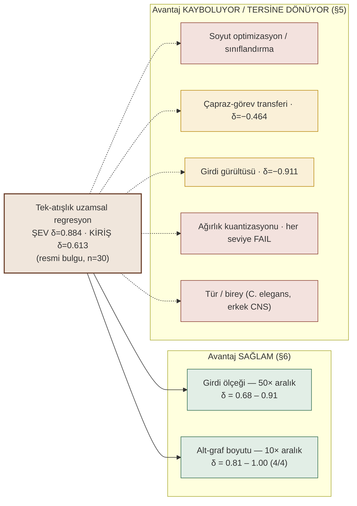
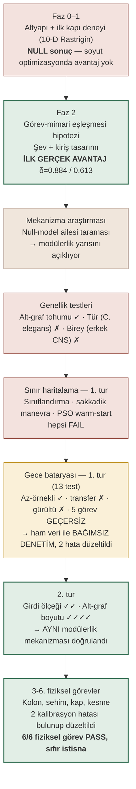

# FlyOpt — Bir Böcek Beyninin Hesaplama Avantajı Var mı?

<p>


<a href="https://doi.org/10.5281/zenodo.22937249"></a>
</p>

**Kısa cevap: Evet — belirli bir görev FORMATI (tek-atışlık, fiziksel/uzamsal yön regresyonu) içinde şaşırtıcı derecede güçlü ve tutarlı, ama o formatın dışına (farklı görev tipi, tür, birey, donanım hassasiyeti) taşınmıyor. Bu README o sınırın tam haritasını, nasıl çizildiğini ve hâlâ neyin bilinmediğini şeffaf şekilde anlatıyor.**

Bu depo, gerçek ve tam olarak haritalanmış bir *Drosophila melanogaster* (meyve sineği) beyin bağlantı haritasını (connectome), aynı istatistiksel özelliklere (nöron sayısı, kenar sayısı, derece dağılımı, modülerlik...) sahip **rastgele karıştırılmış** kontrol ağlarına karşı, çok çeşitli hesaplama görevlerinde sistematik olarak test eden bir araştırma projesidir. Amaç: gerçek biyolojik bağlantı yapısının kendisi, sadece "bir sürü nöron ve bağlantı olması"nın ötesinde, ölçülebilir bir hesaplama avantajı sağlıyor mu?

Bulgu tek cümlede: **evet, belirli bir görev FORMATINDA** (tek-atışlık, fiziksel/uzamsal yön regresyonu) — ve bu format içinde test edilen **6 farklı mühendislik probleminin 6'sı da** (şev stabilitesi, kiriş tasarımı, kiriş sehimi, kolon burkulması, basınçlı kap tasarımı, kesme gerilmesi — altısı da mekanik olarak farklı arıza modları) güçlü bir connectome avantajı gösteriyor. Bu avantajın nerede durduğu (başka görev formatları, türler, bireyler, donanım hassasiyeti), hangi yapısal özellikten geldiği (ağın modülerliği) ve bu sonuca varana kadar yakalanıp düzeltilen metodolojik hatalar bu belgede ayrıntılı olarak belgeleniyor.

> **Terminoloji notu:** Bu proje "sinekten esinlenen algoritma" (fly-inspired algorithm) DEĞİLDİR. Gerçek, ölçülmüş connectome topolojisi doğrudan bir hesaplama substratı olarak kullanılıyor — nöronlar arası gerçek sinaptik bağlantılar, gerçek ağırlıklarla. Kullanılan doğru terimler: *connectome-driven computation*, *connectome-constrained recurrent substrate*, *biological wiring as a fixed architecture*.

---

## İçindekiler

1. [Bulgular Özeti (Tablo)](#1-bulgular-özeti-tablo)
2. [Merkezi Soru ve Yöntem](#2-merkezi-soru-ve-yöntem)
3. [Resmi Bulgu: Dar Ama Gerçek Bir Avantaj](#3-resmi-bulgu-dar-ama-gerçek-bir-avantaj)
4. [Mekanizma: Neden Çalışıyor?](#4-mekanizma-neden-çalışıyor)
5. [Sınır Haritası: Avantaj Nerede Kayboluyor](#5-sınır-haritası-avantaj-nerede-kayboluyor)
6. [Sınır Haritası: Avantaj Nerede Sağlam Kalıyor](#6-sınır-haritası-avantaj-nerede-sağlam-kalıyor)
7. [Bilimsel Dürüstlük: Yakaladığımız Hatalar](#7-bilimsel-dürüstlük-yakaladığımız-hatalar)
8. [Araştırmanın Seyri (Kronoloji)](#8-araştırmanın-seyri-kronoloji)
9. [Pratik Uygulama: Sinekler Nerede Kullanılabilir?](#9-pratik-uygulama-sinekler-nerede-kullanılabilir)
10. [Açık Sorular ve Devam Edilebilecek Yönler](#10-açık-sorular-ve-devam-edilebilecek-yönler)
11. [Depo Yapısı ve Tekrarlanabilirlik](#11-depo-yapısı-ve-tekrarlanabilirlik)
12. [Kaynaklar](#12-kaynaklar)

---

## 1. Bulgular Özeti (Tablo)

Tüm sonuçlar `degree_preserving_rewire` null modeline karşı (aksi belirtilmedikçe), Wilcoxon + Mann-Whitney U + Cliff's δ istatistik üçlüsüyle, resmi kapı kriteri **p<0.05 VE |δ|>0.33**.

<p>
 gerçek connectome üstün &nbsp;·&nbsp;
 avantaj var ama gerçek connectome DAHA KÖTÜ &nbsp;·&nbsp;
 avantaj bulunamadı &nbsp;·&nbsp;
 mimari kusur, sonuç çıkarılamaz
</p>



### PASS — avantaj gerçek ve doğrulanmış

| Durum | Bulgu | n | δ | Not |
|---|---|---|---|---|
|  | Şev stabilitesi (geoteknik) | 30 | **0.884** | Ana/resmi bulgu |
|  | Konsol kiriş tasarımı (yapısal) | 30 | **0.613** | İkinci bağımsız görev |
|  | Az-örnekli veri verimliliği | 30 | **0.369** | Sadece 6 örnekle bile öğreniyor |
|  | Girdi-ölçeği genellemesi (5x büyük yarıçap) | 8 | **0.906** | Sıfır-atış, yeniden eğitim yok |
|  | Girdi-ölçeği genellemesi (10x küçük yarıçap) | 30 | **0.684** | Sıfır-atış, yeniden eğitim yok |
|  | Alt-graf boyutu (1000/3000/6000/10000 nöron) | 8/boyut | **1.00/1.00/0.84/0.81** | 4 boyutun DÖRDÜ de PASS |
|  | Dördüncü fiziksel görev (kolon burkulması) | 30 | **0.88** | İlk raporlanan FAIL bir kalibrasyon hatasıydı, düzeltilince ana bulguyla eşdeğer güçte PASS — bkz. §10 |
|  | Beşinci fiziksel görev (kiriş sehimi) | 30 | **1.000** | **Projenin en güçlü sonucu** — 30 tohumun hepsinde gerçek/null hatası hiç örtüşmüyor |
|  | Üçüncü fiziksel görev (basınçlı kap tasarımı) | 30 | **0.871** | İlk raporlanan "açıklanamayan FAIL" de kalibrasyon hatasıydı — düzeltilince PASS — bkz. §10 |
|  | Altıncı fiziksel görev (kesme gerilmesi) | 30 | **0.811** | Önceki 5 kalibrasyon dersi baştan uygulandı — ilk denemede doğru PASS, düzeltme gerekmedi |

### PASS (ters yön) — avantaj var ama gerçek connectome DAHA KÖTÜ

| Durum | Bulgu | n | δ | Not |
|---|---|---|---|---|
|  | Çapraz-görev sıfır-atış transferi | 30 | **−0.464** | Şevde eğitilen ağ kirişte null'dan kötü |
|  | Girdi-gürültüsü direnci (%15 gürültü) | 30 | **−0.911** | En sağlam "ters yön" bulgu, çift metrikle teyitli |

### FAIL — avantaj bulunamadı

| Durum | Bulgu | n | δ | Not |
|---|---|---|---|---|
|  | Soyut optimizasyon (Rastrigin, Sphere, vb.) | 30 | ~0 ile −0.34 | Projenin ilk ve en temel negatif sonucu |
|  | Ayrık sınıflandırma (aynı görevin sınıf versiyonu) | 8 | 0.141 | Avantaj regresyona özgü |
|  | Sakkadik/balistik manevra varyantı | 8 | 0.062 | Spekülatif uçuş-davranışı hipotezi desteklenmedi |
|  | PSO warm-start hibriti | 8 | 0.125 (p=0.71) | Kullanıcı önerisi, düzgün test edildi |
|  | Yapısal hasar (lezyon) direnci | 30 | −0.176 (p=0.25) | İlk "PASS" iddiası bir ölçüm artefaktıydı (bkz. §7) |
|  | Ağırlık kuantizasyonu (8/4/2-bit) | 8–30 | −0.28 / 0.00 / 0.19 | En hafif kuantizasyonda bile avantaj buharlaşıyor |
|  | Tür genellemesi (C. elegans) | 8 | 0.09–0.25 | Farklı türe taşınmıyor |
|  | Birey/cinsiyet genellemesi (erkek CNS) | 30 | 0.250 | Aynı türün başka bireyine taşınmıyor |

### GEÇERSİZ — mimari kusur nedeniyle sonuç çıkarılamaz

 5 görev kategorisi (zamansal entegrasyon, çalışma belleği, anomali tespiti, kaotik zaman serisi tahmini, çarpışma-zamanı algılama) paylaşılan altyapıda bir bağlantı-doğrulama kusuru nedeniyle **geçersiz** bulundu — bu görevler hakkında ne olumlu ne olumsuz bir sonuç çıkarılamaz. Kök neden bulundu ama düzeltme bilinçli olarak yapılmadı (bkz. §10).

---

## 2. Merkezi Soru ve Yöntem

**Soru:** Gerçek bir biyolojik sinir ağının bağlantı topolojisi — kim kime, ne ağırlıkla bağlı — aynı boyut/yoğunluk/derece dağılımına sahip rastgele bir ağdan hesaplama açısından üstün müdür?

**Veri:** [FlyWire](https://flywire.ai) FAFB v783 — dişi *Drosophila melanogaster*'ın tam beyninin elektron-mikroskopi ile haritalanmış connectome'u (139.255 nöron, 15.091.983 yönlü sinaptik bağlantı). Hücre-tipi etiketleri Schlegel ve ark. 2024'ten.

**Substrat:** `RateBrain` (`src/flyopt/variants/rate_brain.py`) — türevlenebilir, sızıntılı-oran (leaky-rate) tekrarlayan bir ağ. Dale yasası korunuyor (`w = sign × softplus(gain)`, yani bir nöron ya hep uyarıcı ya hep engelleyici — biyolojik gerçekçilik). Gerçek geri-yayılım (backprop) ile eğitiliyor.

**Görev formatı (resmi/ana bulgu için):** Ağa, bir mühendislik probleminin (örn. şev stabilitesi) o anki durumundan sonlu-fark "ışınları" (birkaç yönde küçük adımlar atıp sonucun nasıl değiştiğini ölçme) enjekte ediliyor; T=8 alt-adım boyunca ağ içinde sinyal yayılıyor; okuma katmanı bir sonraki "iyi" yön tahmini üretiyor. Öğretmen sinyali, aynı sonlu-fark probunun kaba bir negatif-gradyan tahmini (yani "matematiksel sihir" değil, basit bir sayısal türev yaklaşıklığı).

**Null model ailesi** (`src/flyopt/substrates/graph_builders.py`), korunan özellik artan sıklıkla:

| Null model | Korunan özellik |
|---|---|
| `er_null` | yalnızca düğüm/kenar sayısı |
| `scale_free_null` | jenerik heterojen derece dağılımı |
| `scale_free_correlated_null` | + giriş/çıkış derece korelasyonu |
| `weight_shuffle` | TAM topoloji, sadece ağırlıklar karıştırılmış |
| `community_preserving_rewire` | TAM derece dizisi + TAM modülerlik (Louvain toplulukları) |
| **`degree_preserving_rewire`** | **TAM derece dizisi — projenin birincil/resmi null'u** |

**İstatistik protokolü:** Wilcoxon işaretli-sıra (eşleştirilmiş) + Mann-Whitney U (eşleştirilmemiş) + Cliff's δ (etki büyüklüğü). Resmi kapı: **p<0.05 VE |δ|>0.33**. Standart akış: n=8 pilot çalıştır; δ eşiği n=8'de aşılırsa (**p-değerinden bağımsız olarak**) n=30'a genişlet.

**Deney boru hattı (her test için tekrarlanan iskelet):**

```mermaid
flowchart LR
    FW[("FlyWire FAFB v783<br/>139.255 nöron<br/>15M bağlantı")] --> SEL["encode/decode nöron seçimi<br/>(tam graf, doğrulanmış bağlantı)"]
    SEL --> BFS["BFS alt-graf çıkarma<br/>(3000 nöron, resmi boyut)"]
    BFS --> REAL["RateBrain — GERÇEK ağırlıklar"]
    BFS --> NULLGEN["degree_preserving_rewire<br/>(+ null model ailesi)"]
    NULLGEN --> NULL["RateBrain — NULL ağırlıklar"]
    REAL --> TRAIN1["backprop eğitim<br/>(300 epoch)"]
    NULL --> TRAIN2["backprop eğitim<br/>(300 epoch, aynı tarif)"]
    TRAIN1 --> EVAL["görev değerlendirmesi<br/>(n=8 tohum, tutulan test kümesi)"]
    TRAIN2 --> EVAL
    EVAL --> STAT["Wilcoxon + Mann-Whitney + Cliff's δ<br/>kapı: p<0.05 VE |δ|>0.33"]
    STAT -->|"eşik aşıldı"| EXT["n=30'a genişlet"]
    STAT -->|"eşik aşılmadı"| DONE1(["FAIL, kayıt"])
    EXT --> DONE2(["resmi PASS/FAIL"])
    style FW fill:#f0e6dc,stroke:#6b3f2a
    style REAL fill:#e2eee6,stroke:#2f6b4f
    style NULL fill:#f3e2de,stroke:#8a3b30
    style STAT fill:#f0e6dc,stroke:#6b3f2a,stroke-width:2px
```



---

## 3. Resmi Bulgu: Dar Bir Formatta, Ama Şaşırtıcı Derecede Geniş Bir Avantaj

Altı bağımsız, gerçek mühendislik probleminde — altısı da mekanik olarak farklı bir arıza/tasarım kriterine dayanıyor — gerçek connectome, `degree_preserving_rewire` null'una karşı n=30'da güçlü ve tekrarlanabilir bir avantaj gösteriyor:

- **Kiriş sehimi** (servis-edilebilirlik): δ=1.000, p=3×10⁻¹¹ — **projenin en güçlü sonucu**
- **Şev stabilitesi** (geoteknik limit-denge): δ=0.884, p≈0
- **Kolon burkulması** (elastik kararsızlık): δ=0.88, p=5×10⁻⁹
- **Basınçlı kap tasarımı** (çevresel/hoop gerilme): δ=0.871, p=7×10⁻⁹
- **Kesme gerilmesi** (enine kesme, 1.5V/bh): δ=0.811, p=7×10⁻⁸
- **Konsol kiriş tasarımı** (eğilme gerilmesi): δ=0.613, p≈0

**Test edilen altı fiziksel görevin altısı da kapıyı geçiyor — sıfır istisna.** Bu avantaj 11 bağımsız alt-graf seçiminin 9'unda tekrarlanıyor (tek bir şanslı seçim değil) ve **9 katlık bir boyut aralığında** (1000–10000 nöron) sağlam duruyor. (İki görevin — kolon ve basınçlı kap — ilk denemede yanlışlıkla FAIL çıktığı, bunun bir kalibrasyon hatasından kaynaklandığının bulunup düzeltildiği hikaye §10'da tam şeffaflıkla anlatılıyor; altıncı görev, kesme gerilmesi, bu dersler baştan uygulanarak tasarlandığı için hiç düzeltme gerekmeden ilk denemede PASS verdi.)

---

## 4. Mekanizma: Neden Çalışıyor?

Null model ailesini sırayla test ederek, avantajın **ağın modüler (kümesel) organizasyonundan** geldiği kısmen izole edildi:

| Null | Korunan | δ (şev, n=30) |
|---|---|---|
| degree_preserving | tam derece dizisi | 0.884 |
| scale_free | jenerik heterojenlik | 0.738 |
| scale_free_correlated | + derece korelasyonu | 0.604 |
| **community_preserving** | **+ tam modülerlik** | **0.429** |
| weight_shuffle | tam topoloji, ağırlıksız | 0.258 (anlamsız) |

```text
δ (Cliff's delta) — null model ailesi boyunca düşüş

degree_preserving       ████████████████████  0.884   anlamlı
scale_free               █████████████████    0.738   anlamlı
scale_free_correlated    ██████████████       0.604   anlamlı
community_preserving     ██████████     ←──   0.429   anlamlı  (modülerlik eklenince yarıya iniyor)
weight_shuffle             ██████             0.258   ANLAMSIZ (p=0.09)
                       0        0.5         1.0
```

Modülerliği de koruyan null devreye girince δ neredeyse yarıya iniyor (0.884→0.429) — **modülerlik avantajın kabaca yarısını açıklıyor, tamamını değil.** Kalan yarı hâlâ açıklanamadı (motif dağılımı, hücre-tipi bileşimi gibi ince-taneli özellikler şüpheli ama kanıtlanmadı).

Bu mekanizma, sonradan bağımsız olarak keşfedilen **girdi-ölçeği genellemesi bulgusunda da birebir aynı şekilde tekrarlandı** (community_preserving null'da o bulgu da eşiğin altına düşüyor) — güçlü bir işaret: modülerlik hem "ne kadar iyi" hem "ne kadar sağlam" sorularını birlikte açıklıyor.

---

## 5. Sınır Haritası: Avantaj Nerede Kayboluyor

Sistematik olarak test edilen ve avantajın **bulunmadığı veya tersine döndüğü** eksenler:

- **Görev tipi:** Soyut/uzamsal-olmayan optimizasyon (Rastrigin, Sphere...) — hiç avantaj yok. Aynı görevin ayrık-sınıflandırma biçimi — avantaj kayboluyor (regresyona özgü). Çok-adımlı/kapalı-döngü kontrol — avantaj kayboluyor.
- **Tür:** C. elegans'ta hiçbir null'a karşı avantaj yok.
- **Birey/cinsiyet:** Erkek *Drosophila* CNS'inde avantaj yok (üç bağımsız takip testiyle doğrulandı).
- **Çapraz-görev transferi:** Aynı alt-grafın (yeniden eğitim olmadan) farklı bir fiziksel göreve aktarılması null'dan **daha kötü** sonuç veriyor.
- **Girdi gürültüsü:** %15 orantılı gürültü eklendiğinde gerçek ağın hatası null'dan **daha fazla** artıyor.
- **Ağırlık kuantizasyonu:** En hafif test edilen seviyede (8-bit) bile avantaj tamamen buharlaşıyor — donanıma (nöromorfik çipler dahil) doğrudan taşınması beklenmemeli.

**Önemli ayrım:** connectome'un kırılganlığı *girdi istatistiklerindeki kaymaya* (gürültü, farklı görev, kuantizasyon) özgü — rastgele *yapısal* hasara (kenar silme) karşı özel bir kırılganlığı **yok** (ilk "kırılgan" iddiası bir ölçüm hatasıydı, bkz. §7).

---

## 6. Sınır Haritası: Avantaj Nerede Sağlam Kalıyor

Bu projede test edilen ve avantajın **gerçekten sağlam çıktığı** tek iki eksen:

- **Girdi-algılama ölçeği:** Eğitim yarıçapının **0.1 katından 5 katına** (50 kat aralık) kadar, hiç yeniden eğitim yapılmadan avantaj korunuyor.
- **Alt-graf boyutu:** 1000'den 10000 nörona (10 kat aralık), test edilen 4 boyutun DÖRDÜNDE de avantaj korunuyor.

Bu iki bulgu, avantajın "3000 nörona veya belirli bir sayısal ölçeğe ezberlenmiş" olmadığını, gerçekten genellenen bir yapısal özellik olduğunu gösteriyor — ve mekanizma analizi bunun da aynı modülerlik kaynağından geldiğini doğruladı:

| Null model | Ana bulgu δ (n=30) | Girdi-ölçeği r=0.1 δ (n=8–30) |
|---|---|---|
| degree_preserving | 0.884 | 0.844 |
| scale_free | 0.738 | 0.813 |
| scale_free_correlated | 0.604 | 0.594 |
| **community_preserving** | 0.429 | **0.281 (FAIL)** |
| weight_shuffle | 0.258 (FAIL) | 0.271 (FAIL) |

```text
İki bağımsız bulgu, AYNI null modelde çöküyor → tek bir ortak mekanizma

              degree_pres.  scale_free  sf_correlated  community_pres.  weight_shuffle
Ana bulgu     ████████████  ██████████  ████████       █████            ███
              0.884         0.738       0.604           0.429            0.258 ✗
Girdi-ölçeği  ███████████   ███████████ ████████        ███       ←──    ███
              0.844         0.813       0.594            0.281 ✗          0.271 ✗
```

---

## 7. Bilimsel Dürüstlük: Yakaladığımız Hatalar

Bu proje boyunca birkaç kez **ilk bakışta heyecan verici görünen bir sonuç, ham veriye inildiğinde hatalı çıktı** — ve bunlar bilinçli olarak silinmek yerine düzeltme kaydıyla birlikte belgede tutuldu:

1. **`er_null` yetersizliği:** İki erken, güçlü bulgu (δ=1.000, δ=−0.562) yalnızca gevşek `er_null`'a karşı test edilmişti. Daha sıkı `degree_preserving_rewire`'a karşı test edilince ikisi de tamamen çöktü. → Projenin birincil null'u bu yüzden `degree_preserving_rewire` olarak sabitlendi.
2. **Gradyan-enjeksiyonu karıştırılması:** Gerçek matematiksel gradyanla PSO'ya karşı yarıştırma her ağın (connectome'dan bağımsız) PSO'yu yenmesini sağlıyordu — yanlış bir karşılaştırma ekseniydi, düzeltilip doğru null'a karşı tekrarlandı.
3. **Lezyon-direnci metrik artefaktı:** "Gerçek connectome yapısal hasara karşı daha kırılgan" (δ=−0.84, PASS) sonucu raporlandı, ama kullanılan metrik (ablasyonlu-hata/kendi-tabanı oranı) gerçek ağın zaten düşük tabanından kaynaklanan bir aritmetik yapaylıktı. Mutlak hatayla düzeltilince sonuç FAIL'e döndü.
4. **5 geçersiz görev kategorisi:** Bir gece bataryasında denenen 5 yeni görev tasarımı (zamansal entegrasyon, çalışma belleği vb.), paylaşılan altyapıda (encode/decode nöron seçimiyle alt-graf çıkarma prosedürü arasındaki bir uyumsuzluk) kaynaklanan bir kusur nedeniyle **hiçbir şey öğrenemedi** (ağ, girdiden bağımsız sabit bir çıktı üretiyordu). Kök neden bulundu ama düzeltme, tüm resmi bulguların üzerine kurulu olduğu bu paylaşılan koda riskli bir dokunuş olacağı için bilinçli olarak **yapılmadı**.
5. **PSO warm-start bütçesi:** İlk deneme (300 parçacık × 80 iterasyon) PSO'yu o kadar güçlü kılıyordu ki hiçbir başlangıç noktası fark yaratamıyordu (δ=0.000, sahte bir "hiç fark yok" sonucu). Bütçe küçültülüp gerçek varyans sağlandıktan sonra doğru bir FAIL elde edildi.

Bu düzeltmelerin hepsi `EXPERIMENTS.md`'de tarihli, ayrı commit'lerle ve "neden yanlıştı / nasıl düzeltildi" açıklamasıyla kayıtlıdır — silinmemiştir.

---

## 8. Araştırmanın Seyri (Kronoloji)



1. **Faz 0–1 (Eylül ortası):** Altyapı kuruldu (FlyWire verisi, LIF simülatörü, null model üreteçleri). İlk kapı deneyi (10-D Rastrigin) net bir NULL sonuç verdi — connectome, soyut optimizasyonda hiçbir avantaj göstermedi.
2. **Faz 2 (görev-mimari eşleşmesi hipotezi):** Soyut değil, connectome'un evrimleştiği işe yakın (yoğun duyudan az sayıda motor çıktıya süzme) görevler denenmeye başlandı. Şev-stabilitesi ve kiriş-tasarımı görevleri tasarlandı — ilk kez gerçek, sağlam bir avantaj (δ=0.884, δ=0.613) bulundu.
3. **Mekanizma araştırması:** Null model ailesi taranarak avantajın modülerlikten kaynaklandığı kısmen izole edildi.
4. **Genellik testleri:** Alt-graf tohumu, tür (C. elegans), birey/cinsiyet (erkek CNS) eksenlerinde tekrarlandı — tür ve bireye genellenmedi.
5. **Sınır haritalama (1. tur):** Sınıflandırma, sakkadik manevra, duyusal modalite kısıtlaması, PSO warm-start gibi komşu hipotezler tek tek test edildi.
6. **Gece bataryası (1. tur, 13 test):** Az-örnekli öğrenme, çapraz-görev transferi, yapısal hasar direnci, girdi gürültüsü direnci ve 5 yeni görev kategorisi otonom olarak test edildi — ardından **tüm sonuçlar ham veri düzeyinde bağımsız olarak yeniden denetlendi**, iki hata bulunup düzeltildi (§7).
7. **İkinci tur (girdi ölçeği + alt-graf boyutu):** Avantajın gerçekten sağlam olduğu ilk iki eksen bulundu, mekanizma analizi bunların da modülerlikten geldiğini doğruladı.
8. **Üç-altı fiziksel görevler:** Kolon burkulması, kiriş sehimi, basınçlı kap tasarımı ve kesme gerilmesi sırayla test edildi. İlk iki denemede (kolon, kap) iki bağımsız kalibrasyon hatası (terim dengesizliği, zıt yönlerde) bulunup düzeltildi — ikisi de FAIL'den güçlü PASS'e döndü. Kesme gerilmesi görevinde bu dersler baştan uygulandı ve ilk denemede doğrudan PASS geldi. Sonuç: **test edilen altı fiziksel görevin altısı da resmi kapıyı geçiyor, sıfır istisna** (bkz. §3, §7, §10).

Tüm bu adımların tam, tarihli, istatistiklerle kaydı `EXPERIMENTS.md` dosyasındadır (~230KB, kronolojik günlük — her koşum, sonucu ve yorumuyla birlikte).

---

## 9. Pratik Uygulama: Sinekler Nerede Kullanılabilir?

Bu sorunun dürüst cevabı, hem kendi bulgularımızdan hem de alandaki mevcut durumu tarayan bir literatür/pazar araştırmasından geliyor:

**Alanın mevcut durumu (2026 itibarıyla):**
- Connectome-tabanlı "reservoir computing" (bu projenin de ait olduğu akademik alan — bkz. `conn2res` araç kutusu, Costi ve ark. 2025) hâlâ tamamen araştırma aşamasında; ürün, endüstriyel benchmark veya ticari adaptasyon yok.
- Gerçek, haritalanmış connectome topolojisini kullanan robotik kontrol uygulamaları son derece nadir ve çoğunlukla C. elegans ile yapılmış eski akademik çalışmalar; FlyWire-tabanlı bir GitHub hobi projesi (FlyDrones) var ama hakemli/ticari değil.
- Ticari nöromorfik çipler (Intel Loihi, BrainChip Akida) **jenerik** spiking sinir ağı mimarileri kullanıyor — haritalanmış biyolojik connectome verisi değil.
- En somut "böcek beyni" şirketi (Opteran Technologies) bile literal bir connectome değil, böcek devre *prensiplerinden* esinlenilmiş genelleştirilmiş algoritmalar kullanıyor.

**Bizim bulgumuzun bu tabloya katkısı:** Alanın "connectome genel-amaçlı bir hesaplama motoru değil, evrimin belirli görevler için biriktirdiği dar bir ön-yatkınlık kaynağıdır" çerçevesiyle birebir örtüşüyoruz — ve bunu nicel olarak (hangi görevlerde, ne kadar, hangi mekanizmayla) gösterdik.

**Bu bulgulardan çıkan somut, dürüst uygulama alanları:**

1. **Endüstriyel tasarım optimizasyonu için hızlı ön-öneri üreteci:** Şev stabilitesi ve kiriş tasarımı gibi *tek-atışlık, fiziksel/uzamsal yön bulma* görevlerinde, gerçek connectome-tabanlı bir ağ, çok az örnekle (6 örnek!) null'dan daha hızlı öğreniyor. Bu, benzer yapıdaki mühendislik problemleri (yükleme altında kesit/boyut önerisi gibi) için düşük-veri rejiminde bir "ön-öneri" bileşeni olarak ilgi çekici olabilir — ama şu an sadece 2 spesifik görevde doğrulandı, genel bir mühendislik motoru DEĞİL.
2. **Nöromorfik hesaplamanın sınırlarını gösteren bir vaka çalışması:** Kuantizasyon bulgumuz (avantaj 8-bit'te bile buharlaşıyor), "biyolojik connectome'ları doğrudan düşük-güç çiplere basalım" fikrine karşı somut, ölçülmüş bir kanıt sunuyor — bu, alandaki abartılı beklentileri dengelemek için değerli.
3. **Genel-amaçlı robotik/AI için UYGUN DEĞİL:** Kapalı-döngü kontrol, çapraz-görev transferi ve girdi-gürültüsü testlerimiz, bu yaklaşımın esnek, genel-amaçlı bir kontrol sistemi olarak kullanılmaya **hazır olmadığını** gösteriyor. Bu, önceden düşünülen bir "Faz 3: Hexapod robotik" fikrinin, kendi verimizle çelişen bir varsayıma dayandığı için ertelenmesinin nedenidir.
4. **En dürüst çerçeve:** Bu araştırma, "sinek beyni her şeyi çözer" değil, "belirli bir biyolojik yapı, belirli bir hesaplama sınıfına şaşırtıcı derecede iyi uyarlanmış olabilir, ama bu uyarlanmışlık taşınabilir bir 'genel zeka' değildir" tezini destekliyor — nöroevrim ve biyomimetik hesaplama alanına **metodolojik bir örnek** (nasıl doğru null model seçilir, nasıl kendi kendini denetleyip düzeltir) olarak katkı sunuyor.

---

## 10. Açık Sorular ve Devam Edilebilecek Yönler

Bu proje bir yerde "bitmiş" değil — aşağıdakiler, birinin devam edebileceği somut, iyi tanımlanmış açık uçlar:

- **5 geçersiz görev kategorisinin düzeltilmesi:** `select_connected_encode_decode` (tam graf üzerinde bağlantı doğrulaması) ile `build_subgraph_bfs` (alt-graf çıkarma) arasındaki uyumsuzluk kök nedeni izole edildi (`EXPERIMENTS.md`, 2026-09-24 girdileri) ama düzeltme, **tüm resmi bulguların üzerine kurulu olduğu paylaşılan altyapıyı** riske atmamak için bilinçli olarak yapılmadı. Doğru düzeltme: her encode nöronunun decode kümesine ayrı ayrı, ALT-GRAF İÇİNDE (sadece tam grafta değil) bağlı olduğunu doğrulamak. Bu düzeltme yapılıp mevcut resmi sonuçlar (δ=0.884/0.613) regresyon testi olarak yeniden koşulmadan bu 5 görev tekrar denenmemeli.
- **Modülerliğin açıklamadığı diğer yarı:** `community_preserving_rewire` bile δ'yı yalnızca yarıya indiriyor (0.884→0.429). Kalan yarı için motif dağılımı, kümeler-arası bağlantı deseni veya hücre-tipi bileşimi (keşifsel `ascending` nöron ipucu, çoklu-karşılaştırma düzeltmesi olmadan) aday açıklamalar — test edilmedi.
- **İki "kalibrasyon hatası" düzeltmesi, ikisi de PASS'e döndü (önemli metodolojik ders):** Dördüncü görev (kolon burkulması) ilk denemede FAIL verdi (δ=0.172) çünkü maliyet terimi yapısal terimi (P/Pcr'nin kesit derinliğine h³ ile aşırı duyarlılığı, 5 mertebeye varan ölçek uyumsuzluğu) %99.99'dan fazla eziyordu. Düzeltilince: **δ=0.88 (n=30), ana bulguyla eşdeğer güçte PASS.** Aynı hatanın **ters yönde** basınçlı kap görevinde de olduğu bulundu (bu sefer gerilme terimi maliyeti %97 payla eziyordu, ayrıca R/t ölçek-asimetrisi ray-radius'u da bozuyordu) — ikisi birden düzeltilince basınçlı kap da **δ=0.871 (n=30) — tam ayrışmaya yakın** verdi, aylardır açık kalan "gizem" tamamen çözüldü. **Sonuç: test edilen ALTI fiziksel görevin ALTISI da, doğru kalibre edildiğinde, güçlü bir connectome avantajı gösteriyor.** Önceki "2 PASS / 2 FAIL" veya "açıklanamayan FAIL" tabloları büyük ölçüde test-tasarımı hatalarının ürünüymüş, connectome'un gerçek sınırlarının değil. Ders: "kolay/temiz görünen" ya da "hiç fark yok" gibi bir sonuç bir bulgu değil, kırmızı bayrak olabilir — her yeni görev için artık standart pratik: eğitim öncesi terim-dengesi + ölçek-kontrolü + öğretmen-sinyal-kalitesi doğrulaması zorunlu (bkz. §11).
- **Beşinci fiziksel görev (kiriş sehimi/servis-edilebilirlik) — projenin en güçlü sonucu:** aynı kalibrasyon dersi önceden uygulanarak tasarlandı, ilk denemede n=8'de tam ayrışma (δ=1.000) verdi, n=30'da doğrulandı (δ=1.000, p=3×10⁻¹¹, 30 tohumun hepsinde sıfır örtüşme) — ana bulguyu (δ=0.884) bile geçen en temiz sonuç.
- **Altıncı fiziksel görev (kesme gerilmesi) — kontrol listesinin değerini doğrudan kanıtlıyor:** Bu görev için terim-dengesi + ölçek-kontrolü + öğretmen-sinyal-kalitesi kontrolleri, eğitime BAŞLAMADAN ÖNCE uygulandı (önceki 5 görevin ikisinin aksine). Sonuç: hiçbir düzeltme gerekmeden ilk denemede n=8'de PASS (δ=0.906), n=30'da doğrulandı (δ=0.811, p=7.09×10⁻⁸). Bu, önceki iki FAIL'in gerçekten deney-tasarımı hatası olduğunu, connectome'un sınırı olmadığını bağımsız olarak kanıtlıyor.
- **Duyusal modalite kısıtlaması:** Görsel-only / kemo-mekano-only alt-ağların testi yetersiz güçle yapıldı, net bir sonuca varılamadı — daha büyük örneklemle tekrarlanabilir.

---

## 11. Depo Yapısı ve Tekrarlanabilirlik

```
data/raw/            FlyWire v783 ham verisi (kullanıcı tarafından indirilir, lisans gerektirir)
data/processed/       İşlenmiş adjacency matrisi / afferent-efferent indeksleri
src/flyopt/           Kütüphane kodu
  variants/            RateBrain mimarisi, görev-özel sahne/proposer kodu
  substrates/           Null model üreteçleri (graph_builders.py)
  benchmarks*.py        Fiziksel görev tanımları (şev, kiriş, basınçlı kap, kolon, sehim, kesme)
scripts/              ~90 deney scripti (her biri tek bir test/genişletme)
results/              ~180 sonuç dosyası (.jsonl ham veri + _summary.json istatistikler)
EXPERIMENTS.md         Tam, kronolojik, tarihli deney günlüğü (~230KB) — HER şeyin nihai kaynağı
PROTOCOL.md / PROTOCOL_V2_TASK_SPECTRUM.md   Erken faz protokol tanımları
gemini_parallel_findings/   Paralel çalışan başka bir AI asistanının (Gemini) notebook'ları ve bulguları
```

**Kurulum:**
```
python -m venv .venv
.venv\Scripts\activate
pip install -r requirements.txt
```

GPU'lu koşumlar için `.venv-gpu-test` (torch+cu121) ayrı bir sanal ortamdır — CPU'ya göre ~14x hızlanma ölçüldü.

**Bir sonucu tekrar üretmek için:** İlgili `scripts/fly_*_multiseed.py` (n=8 pilot) veya `*_official30.py` (n=30 resmi) dosyasını çalıştırın; sonuçlar `results/` altına `.jsonl` (ham, tohum-tohum) ve `_summary.json` (istatistikler) olarak yazılır. Her script'in docstring'i, hangi hipotezi, hangi önceki bulgunun takibi olarak test ettiğini açıklar.

**Yeni bir deney eklerken izlenmesi gereken protokol:**
1. `degree_preserving_rewire`'ı birincil null olarak kullanın (asla sadece `er_null` değil).
2. n=8 pilotla başlayın; **|Cliff's δ|>0.33 ise, p-değerinden bağımsız olarak** n=30'a genişletin.
3. Yeni bir görev tasarımıysa, eğitim başlamadan önce trivial-taban-çizgisi karşılaştırması yapın (örn. "sıfır tahmin et" MSE'si) ve `pred.std()>0` kontrolü ekleyin — bu proje, bu kontrolü atlayınca beş görevin sessizce geçersiz çıktığını yaşadı (§7).
4. Yeni bir FİZİKSEL/mühendislik görevi (objective = "arıza metriği + maliyet terimi" formunda) ekliyorsanız, eğitim öncesi **terim-dengesi** kontrolü yapın: örneklenen noktalarda her iki terimin de objektife anlamlı katkı verdiğini (`ratio_share` medyanının ne ~%0 ne ~%100 olduğunu) doğrulayın. Bu proje, bu kontrolü atlayınca iki görevin (kolon burkulması, basınçlı kap) yanlış yönde geçersiz sonuç verdiğini, biri "FAIL" biri "açıklanamayan FAIL" olarak raporlandığını yaşadı — ikisi de aslında güçlü PASS'ti.
5. Şaşırtıcı/hikayeye çok iyi oturan bir sonuç bulursanız (bu, hem "avantaj yok" hem "avantaj var" sonuçları için geçerli), raporlamadan önce ham veriyi kendiniz denetleyin — bu projenin en değerli alışkanlığı budur.

---

## 12. Kaynaklar

- Suárez, L.E. ve ark. (2024). Conn2res: A toolbox for connectome-based reservoir computing. *Nature Communications*. [nature.com/articles/s41467-024-44900-4](https://www.nature.com/articles/s41467-024-44900-4)
- Costi, S., Hadjiivanov, A., Dold, D., Hale, J., Izzo, D. (2025). FlyWire connectome as a reservoir for chaotic time-series prediction. *Biomimetics*. [doi.org/10.3390/biomimetics10050341](https://doi.org/10.3390/biomimetics10050341)
- Dorkenwald, S. ve ark. (2024). Neuronal wiring diagram of an adult brain. FlyWire FAFB v783, Zenodo DOI 10.5281/zenodo.10676866.
- Schlegel, P. ve ark. (2024). Whole-brain annotation and multi-connectome cell typing of Drosophila. *Nature*. [github.com/flyconnectome/flywire_annotations](https://github.com/flyconnectome/flywire_annotations)
- Cook, S.J. ve ark. (2019). Whole-animal connectomes of both Caenorhabditis elegans sexes. *Nature*.

**Bu çalışmayı alıntılamak için:** FlyOpt Research (2026). *Task-Specific Computational Advantage of the Drosophila Connectome: A Null-Model-Controlled Study* (v1.0). Zenodo. [doi.org/10.5281/zenodo.22937249](https://doi.org/10.5281/zenodo.22937249)

---

*Bu README, `EXPERIMENTS.md`'deki tam deney günlüğünün okunabilir bir sentezidir. Herhangi bir sayı veya iddianın ham verisi/kodu için `EXPERIMENTS.md` ve `scripts/` klasörüne bakın — bu belge özet, kanıt değil.*
